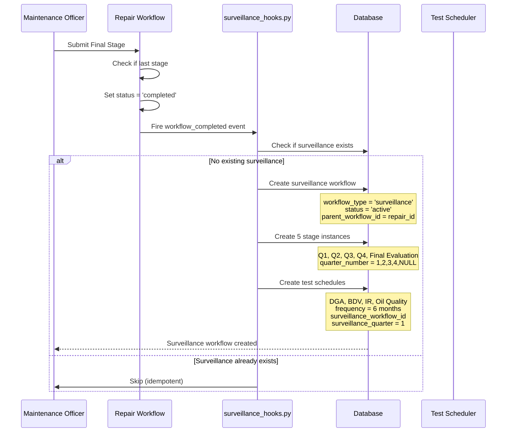
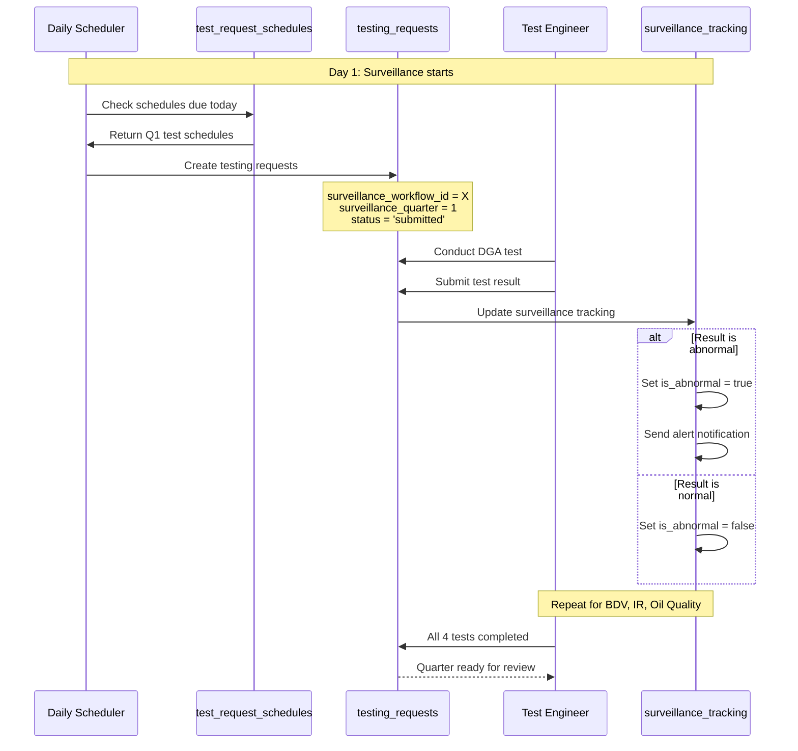
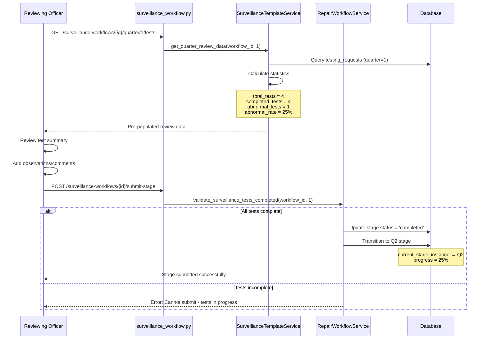
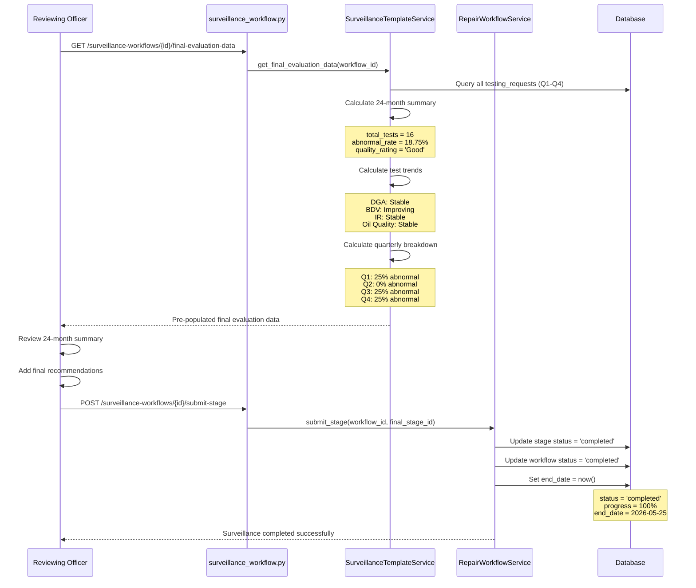

# Surveillance Workflow - User Testing Guide

## Overview

This guide provides step-by-step testing instructions for the Surveillance Workflow module from different user perspectives.

**Test Environment:** `http://localhost:8000` (Backend) | `http://localhost:3000` (Frontend)

**⚠️ IMPORTANT:** All user accounts listed below are created by the `seed.py` script. Ensure you have run the seed script before testing. The actual email domain is `@utility.com` and organization is `KPTCL` with three divisions: RT North, RT South, and Mysuru.

---

## Test User Accounts

### Organization: KPTCL

All users in the format: `{role}.{department}@utility.com` with password: `TestDept@123`

#### RT North Division Users

| Role | Email | Password | Permissions | Description |
|------|-------|----------|-------------|-------------|
| **Maintenance Officer** | maintoff.north@utility.com | TestDept@123 | Full access (view, add, edit, approve) | Can manage all surveillance workflows |
| **Reviewing Officer** | reviewoff.north@utility.com | TestDept@123 | Full access + assign | Can review and approve quarterly submissions |
| **Test Engineer** | testengineer.north@utility.com | TestDept@123 | View + add only (no approve) | Can view workflows and add test data |
| **Supervisory Officer** | supervoff.north@utility.com | TestDept@123 | Full access | Can oversee all surveillance activities |
| **Test & Work Coordinator** | testcoord.north@utility.com | TestDept@123 | Full access | Coordinates testing activities |
| **Transformer Repair Coordinator** | repaircoord.north@utility.com | TestDept@123 | Can assign workflows | Assigns repair and surveillance stages |

#### RT South Division Users

| Role | Email | Password | Permissions | Description |
|------|-------|----------|-------------|-------------|
| **Maintenance Officer** | maintoff.south@utility.com | TestDept@123 | Full access | South division maintenance officer |
| **Reviewing Officer** | reviewoff.south@utility.com | TestDept@123 | Full access + assign | South division reviewing officer |
| **Test Engineer** | testengineer.south@utility.com | TestDept@123 | View + add only | South division test engineer |

#### Mysuru Division Users

| Role | Email | Password | Permissions | Description |
|------|-------|----------|-------------|-------------|
| **Reviewing Officer** | reviewoff.mysuru@utility.com | TestDept@123 | Full access + assign | Mysuru division reviewing officer |
| **Test Engineer** | testengineer.mysuru@utility.com | TestDept@123 | View + add only | Mysuru division test engineer |

#### Organization-Level Users

| Role | Email | Password | Permissions | Description |
|------|-------|----------|-------------|-------------|
| **Circle EE** | ee.circle@utility.com | TestDept@123 | Reviewing Officer | Circle-level officer |
| **Circle SEE** | see.circle@utility.com | TestDept@123 | Reviewing Officer | Senior Executive Engineer - Circle |
| **Zone CEE** | cee.zone@utility.com | TestDept@123 | System Administrator | Chief Executive Engineer - Zone |
| **Organization Admin** | orgadmin@utility.com | OrgAdmin123! | Org Admin | Organization administrator |
| **Super Admin** | superadmin@system.com | Admin123! | Super Admin | System-wide administrator |

---

## Pre-requisites

### 1. Database Setup

Run migrations and seed data:

```bash
cd C:\Yesu\CustomerAPI\Customer-API

# Run surveillance migrations
python run_migration_008.py
python run_migration_013.py

# Run seed script (creates modules, roles, permissions)
python seed.py
```

**Verify:**
- Surveillance modules created in database
- User accounts exist with correct roles
- Stage definitions loaded (Q1-Q4 + Final Evaluation)

### 2. Equipment Setup

**Ensure at least 2 transformers exist with completed repair workflows:**

1. **Equipment:** 220kV Transformer - Station A (UEIC: TRF-001)
   - Must have a completed repair workflow (status = 'completed')
   - This will auto-trigger surveillance workflow

2. **Equipment:** 110kV Transformer - Station B (UEIC: TRF-002)
   - Must have a completed repair workflow
   - For testing second surveillance workflow

**Create via API or UI:**
```bash
# Check if equipment exists
curl http://localhost:8000/equipment?limit=10 \
  -H "Authorization: Bearer <token>"
```

---

## Functional Flow

### High-Level Overview

```
┌─────────────────────────────────────────────────────────────────────────┐
│                   SURVEILLANCE WORKFLOW LIFECYCLE                        │
└─────────────────────────────────────────────────────────────────────────┘

1. TRIGGER: Repair Workflow Completion
   └─→ Hook fires: surveillance_hooks.py
       └─→ Creates surveillance workflow
           └─→ Creates 5 stage instances (Q1-Q4 + Final)
               └─→ Creates test schedules (DGA, BDV, IR, Oil Quality)

2. QUARTERLY CYCLE (Repeat 4 times: Q1 → Q2 → Q3 → Q4)
   ├─→ Daily Scheduler: Creates testing requests from schedules
   ├─→ Test Engineer: Conducts tests, submits results
   ├─→ System: Tracks test completion, flags abnormal results
   └─→ Reviewing Officer: Reviews quarter data, submits stage
       └─→ Stage transitions to next quarter

3. FINAL EVALUATION
   ├─→ System: Aggregates 24-month data
   ├─→ Reviewing Officer: Reviews overall summary, quality rating
   └─→ Surveillance workflow completes

4. COMPLETION
   └─→ Workflow status = 'completed'
       └─→ Equipment exits surveillance period
```

### Detailed Step-by-Step Flow

#### Phase 1: Surveillance Workflow Creation (Auto-Triggered)



**Key Actions:**
1. ✅ Repair workflow completes (final stage approved)
2. ✅ Hook checks if surveillance already exists (idempotency)
3. ✅ Creates surveillance workflow linked to repair workflow
4. ✅ Creates 5 stage instances (one per quarter + final)
5. ✅ Creates test schedules for Q1 (next_due_date = start_date + 0 days)
6. ✅ Sets current stage = Q1 Surveillance Testing

**Database Changes:**
- `repair_workflows`: New row with `workflow_type = 'surveillance'`
- `repair_stage_instances`: 5 rows (Q1-Q4 with `quarter_number`, Final with NULL)
- `test_request_schedules`: 4 rows (DGA, BDV, IR, Oil Quality) with `surveillance_quarter = 1`

---

#### Phase 2: Q1 Testing Period (Days 1-180)



**Key Actions:**
1. ✅ Daily scheduler (`TestRequestScheduleService.run_daily_scheduler()`) runs
2. ✅ Creates testing requests from schedules where `next_due_date <= today`
3. ✅ Test Engineer conducts tests (DGA, BDV, IR, Oil Quality)
4. ✅ System tracks test completion in `repair_surveillance_tests` table
5. ✅ System flags abnormal results based on `surveillance_config.abnormal_statuses`
6. ✅ System sends alerts if abnormal results detected

**Database Changes:**
- `testing_requests`: 4 new rows with `surveillance_quarter = 1`, `status = 'submitted' → 'completed'`
- `repair_surveillance_tests`: 4 new rows tracking each test execution
- `test_request_schedules`: Update `last_created_at`, `next_due_date = last_due + 6 months`

---

#### Phase 3: Q1 Quarterly Review (End of Quarter 1)



**Key Actions:**
1. ✅ Reviewing Officer opens Q1 review form
2. ✅ System pre-populates form with test summary, statistics, abnormal rate
3. ✅ Officer reviews data, adds comments
4. ✅ Officer submits stage
5. ✅ **Validation**: System blocks submission if tests incomplete
6. ✅ Stage transitions: Q1 (completed) → Q2 (active)
7. ✅ Progress updates: 25% (1 of 4 quarters complete)

**Database Changes:**
- `repair_stage_instances`: Q1 row `status = 'completed'`, `completed_at = now()`
- `repair_workflows`: `current_stage_instance_id = Q2_id`, `progress = 25`
- `test_request_schedules`: Create Q2 schedules (DGA, BDV, IR, Oil Quality for quarter 2)

**Form Data Saved:**
```json
{
  "quarter_number": 1,
  "total_tests": 4,
  "completed_tests": 4,
  "abnormal_tests": 1,
  "abnormal_rate": 25.0,
  "test_summary": [
    {"test_type": "DGA", "result": "PASS", "tested_at": "2026-05-20"},
    {"test_type": "BDV", "result": "FAIL", "tested_at": "2026-05-21"},
    {"test_type": "IR", "result": "PASS", "tested_at": "2026-05-22"},
    {"test_type": "Oil Quality", "result": "PASS", "tested_at": "2026-05-23"}
  ],
  "officer_comments": "Q1 surveillance completed. One BDV failure noted.",
  "submitted_by": "reviewoff.north@utility.com",
  "submitted_at": "2026-05-25T10:30:00Z"
}
```

---

#### Phase 4: Q2, Q3, Q4 Testing Periods (Days 181-720)

**Same flow repeats for each quarter:**

```
Q2 (Days 181-360):
├─→ Create Q2 test schedules (DGA, BDV, IR, Oil Quality)
├─→ Daily scheduler creates testing requests
├─→ Test Engineer conducts tests
├─→ Reviewing Officer submits Q2 review
└─→ Transition to Q3 (Progress = 50%)

Q3 (Days 361-540):
├─→ Create Q3 test schedules
├─→ Daily scheduler creates testing requests
├─→ Test Engineer conducts tests
├─→ Reviewing Officer submits Q3 review
└─→ Transition to Q4 (Progress = 75%)

Q4 (Days 541-720):
├─→ Create Q4 test schedules
├─→ Daily scheduler creates testing requests
├─→ Test Engineer conducts tests
├─→ Reviewing Officer submits Q4 review
└─→ Transition to Final Evaluation (Progress = 90%)
```

**Each Quarter:**
- ✅ 4 tests conducted (DGA, BDV, IR, Oil Quality)
- ✅ Test frequency: Every 6 months (2x normal 12-month frequency)
- ✅ Quarterly review submitted
- ✅ Stage transitions automatically
- ✅ Progress increments by 25% per quarter

---

#### Phase 5: Final Evaluation (Day 720 / Month 24)



**Key Actions:**
1. ✅ Reviewing Officer opens Final Evaluation form
2. ✅ System aggregates ALL quarterly data (Q1-Q4)
3. ✅ System calculates:
   - Total tests: 16 (4 per quarter × 4 quarters)
   - Abnormal rate: % of tests with FAIL/MARGINAL/CRITICAL/ALERT results
   - Quality rating: Excellent (0%), Good (<20%), Fair (20-50%), Poor (≥50%)
   - Test trends: Improving / Stable / Deteriorating (per test type)
4. ✅ Officer reviews summary, adds final recommendations
5. ✅ Officer submits final stage
6. ✅ Workflow completes: `status = 'completed'`, `progress = 100%`

**Database Changes:**
- `repair_stage_instances`: Final stage `status = 'completed'`
- `repair_workflows`: `status = 'completed'`, `progress = 100`, `end_date = now()`

**Final Evaluation Form Data:**
```json
{
  "surveillance_period": "24 months",
  "start_date": "2024-05-25",
  "end_date": "2026-05-25",
  "total_tests_conducted": 16,
  "abnormal_tests": 3,
  "abnormal_rate": 18.75,
  "quality_rating": "Good",
  "quarterly_summary": [
    {"quarter": 1, "total": 4, "abnormal": 1, "rate": 25.0},
    {"quarter": 2, "total": 4, "abnormal": 0, "rate": 0.0},
    {"quarter": 3, "total": 4, "abnormal": 1, "rate": 25.0},
    {"quarter": 4, "total": 4, "abnormal": 1, "rate": 25.0}
  ],
  "test_trends": {
    "DGA": "Stable",
    "BDV": "Improving",
    "IR": "Stable",
    "Oil Quality": "Stable"
  },
  "vendor_performance": "Satisfactory",
  "recommendations": "Equipment maintained stable health throughout surveillance period. Continue normal maintenance schedule.",
  "officer_name": "Reviewing Officer",
  "submitted_by": "reviewoff.north@utility.com",
  "submitted_at": "2026-05-25T14:00:00Z"
}
```

---

### System Interactions

#### 1. Workflow Hook System

```python
# surveillance_hooks.py

def _on_repair_workflow_completed(db, workflow, user_id, **kwargs):
    """
    Fires when repair workflow completes.
    
    Trigger: workflow.status = 'completed' AND workflow.workflow_type in ['repair', 'breakdown']
    """
    
    # 1. Idempotency check
    existing = db.query(RepairWorkflow).filter(
        RepairWorkflow.parent_workflow_id == workflow.id,
        RepairWorkflow.workflow_type == 'surveillance'
    ).first()
    
    if existing:
        return  # Already created
    
    # 2. Create surveillance workflow
    surveillance_workflow = RepairWorkflow(
        workflow_type='surveillance',
        parent_workflow_id=workflow.id,
        equipment_id=workflow.equipment_id,
        organization_id=workflow.organization_id,
        department_id=workflow.department_id,
        status='active',
        start_date=date.today()
    )
    
    # 3. Create 5 stage instances (Q1-Q4 + Final)
    # 4. Create test schedules for Q1
    # 5. Link current_stage to Q1
```

#### 2. Daily Scheduler Integration

```python
# services/test_request_schedule_service.py

def run_daily_scheduler():
    """
    Runs daily to create testing requests from schedules.
    
    Called by: Cron job or manual trigger
    """
    
    # Query schedules due today
    schedules = db.query(TestRequestSchedule).filter(
        TestRequestSchedule.next_due_date <= date.today(),
        TestRequestSchedule.is_active == True
    ).all()
    
    for schedule in schedules:
        # Create testing request
        testing_request = TestingRequest(
            title=f"{schedule.test_type.name} - {schedule.equipment.name}",
            test_type_id=schedule.test_type_id,
            equipment_id=schedule.equipment_id,
            surveillance_workflow_id=schedule.surveillance_workflow_id,  # ← Linked!
            surveillance_quarter=schedule.surveillance_quarter,           # ← Linked!
            status='submitted',
            scheduled_start_date=schedule.next_due_date
        )
        
        # Update schedule next_due_date
        schedule.last_created_at = datetime.now()
        schedule.next_due_date = schedule.next_due_date + timedelta(days=schedule.frequency_days)
```

#### 3. Stage Validation

```python
# services/repair_workflow_service.py

def submit_stage(self, workflow_id, stage_instance_id, form_data):
    """
    Submits a stage for approval/transition.
    
    For surveillance workflows: Validates all tests complete before allowing submission.
    """
    
    workflow = self.db.query(RepairWorkflow).filter_by(id=workflow_id).first()
    stage_instance = self.db.query(RepairStageInstance).filter_by(id=stage_instance_id).first()
    
    # Surveillance-specific validation
    if workflow.workflow_type == 'surveillance' and stage_instance.quarter_number:
        self._validate_surveillance_tests_completed(workflow_id, stage_instance.quarter_number)
    
    # Normal stage submission logic...
    
def _validate_surveillance_tests_completed(self, workflow_id, quarter_number):
    """
    Validates all quarterly tests are completed before allowing stage submission.
    
    Prevents officers from submitting review while tests are in progress.
    """
    
    tests = self.db.query(TestingRequest).filter(
        TestingRequest.surveillance_workflow_id == workflow_id,
        TestingRequest.surveillance_quarter == quarter_number
    ).all()
    
    incomplete = [t for t in tests if t.status not in ['completed', 'cancelled']]
    
    if incomplete:
        raise ValueError(
            f"Cannot submit Q{quarter_number} review: "
            f"{len(incomplete)} test(s) still in progress. "
            f"Complete all tests before submitting quarterly review."
        )
```

#### 4. Surveillance Tracking

```python
# services/surveillance_tracking_service.py

def update_test_result(self, testing_request_id, test_status, result_status, tested_at):
    """
    Updates surveillance test tracking when test completes.
    
    Called by: testing_service.py when test result is submitted
    """
    
    # Find surveillance test record
    surveillance_test = self.db.query(RepairSurveillanceTest).filter(
        RepairSurveillanceTest.testing_request_id == testing_request_id
    ).first()
    
    if not surveillance_test:
        return  # Not a surveillance test
    
    # Update tracking
    surveillance_test.test_status = test_status
    surveillance_test.tested_at = tested_at
    
    # Check if result is abnormal
    config = SurveillanceConfigService.get_config(
        self.db,
        organization_id=surveillance_test.surveillance_workflow.organization_id
    )
    
    surveillance_test.is_abnormal = result_status in config['abnormal_statuses']
    
    # Send alert if abnormal
    if surveillance_test.is_abnormal:
        self._send_abnormal_alert(surveillance_test)
```

---

### Data Flow Diagram

```
┌─────────────────────────────────────────────────────────────────────────┐
│                        SURVEILLANCE DATA FLOW                            │
└─────────────────────────────────────────────────────────────────────────┘

1. WORKFLOW CREATION
   repair_workflows (parent) 
   ↓
   [Hook: surveillance_hooks.py]
   ↓
   repair_workflows (surveillance) ← parent_workflow_id, workflow_type='surveillance'
   ↓
   repair_stage_instances (Q1-Q4 + Final) ← quarter_number, workflow_id
   ↓
   test_request_schedules (Q1 tests) ← surveillance_workflow_id, surveillance_quarter=1

2. TEST SCHEDULING
   test_request_schedules (Q1)
   ↓
   [Scheduler: TestRequestScheduleService.run_daily_scheduler()]
   ↓
   testing_requests ← surveillance_workflow_id, surveillance_quarter=1, status='submitted'
   ↓
   repair_surveillance_tests ← surveillance_workflow_id, testing_request_id

3. TEST EXECUTION
   testing_requests (status='submitted')
   ↓
   [Test Engineer: Submit test result]
   ↓
   testing_requests (status='completed', form_data=result)
   ↓
   [Service: surveillance_tracking_service.py]
   ↓
   repair_surveillance_tests ← test_status='completed', is_abnormal=true/false

4. QUARTERLY REVIEW
   testing_requests (quarter=1, status='completed')
   ↓
   [API: SurveillanceTemplateService.get_quarter_review_data()]
   ↓
   Pre-populated form data (test_summary, statistics, abnormal_rate)
   ↓
   [Officer: Submit stage]
   ↓
   repair_stage_instances (Q1: status='completed')
   ↓
   repair_workflows (current_stage_instance_id → Q2, progress=25%)

5. FINAL EVALUATION
   testing_requests (ALL quarters, status='completed')
   ↓
   [API: SurveillanceTemplateService.get_final_evaluation_data()]
   ↓
   Aggregated 24-month summary (quality_rating, test_trends, quarterly_breakdown)
   ↓
   [Officer: Submit final stage]
   ↓
   repair_workflows (status='completed', progress=100%, end_date=now())
```

---

### Quality Rating Calculation

The system calculates quality ratings based on abnormal test rate:

```python
def calculate_quality_rating(abnormal_rate: float) -> str:
    """
    Calculate equipment quality rating based on abnormal test percentage.
    
    Thresholds (configurable in surveillance_config):
    - Excellent: 0% abnormal
    - Good: < 20% abnormal
    - Fair: 20-50% abnormal
    - Poor: ≥ 50% abnormal
    """
    
    if abnormal_rate == 0:
        return 'Excellent'
    elif abnormal_rate < 20:
        return 'Good'
    elif abnormal_rate < 50:
        return 'Fair'
    else:
        return 'Poor'
```

**Examples:**
- Q1: 4 tests, 0 abnormal → 0% → **Excellent**
- Q2: 4 tests, 1 abnormal → 25% → **Fair**
- Q3: 4 tests, 2 abnormal → 50% → **Poor**
- Q4: 4 tests, 3 abnormal → 75% → **Poor**
- Overall: 16 tests, 3 abnormal → 18.75% → **Good**

---

### Test Frequency Multiplier

Surveillance tests run at **2x normal frequency**:

| Test Type | Normal Frequency | Surveillance Frequency | Multiplier |
|-----------|------------------|------------------------|------------|
| DGA | 12 months | 6 months | 2.0× |
| BDV | 12 months | 6 months | 2.0× |
| IR | 12 months | 6 months | 2.0× |
| Oil Quality | 12 months | 6 months | 2.0× |

**Configuration:**
```sql
-- surveillance_config table
surveillance_period_months = 24  -- Total surveillance duration
frequency_multiplier = 2.0       -- Tests run 2x more frequently
```

**Calculation:**
```python
normal_frequency = 12  # months
surveillance_frequency = normal_frequency / frequency_multiplier
# 12 / 2.0 = 6 months
```

---

### Permission Control (RBAC)

Surveillance workflows use the same **repair_stage_roles** table for permission control:

```sql
-- Stage: Q1 Surveillance Testing
SELECT r.name as role_name, rsr.*
FROM repair_stage_roles rsr
JOIN repair_stage_definitions rsd ON rsr.stage_id = rsd.id
JOIN org_roles r ON rsr.role_id = r.id
WHERE rsd.code = 'Q1_SURVEILLANCE';

-- Results:
-- Reviewing Officer:     can_view=true, can_edit=true, can_approve=true, can_assign=true
-- Maintenance Officer:   can_view=true, can_edit=true, can_approve=true
-- Test Engineer:         can_view=true, can_edit=true (but cannot approve)
```

**Permission Logic:**
1. ✅ `can_view`: User can see the workflow
2. ✅ `can_edit`: User can open forms and save draft data
3. ✅ `can_approve`: User can submit stage for transition
4. ✅ `can_assign`: User can assign stages to other users

**Validation:**
- User must have `can_approve=true` to submit quarterly review
- User must have `can_assign=true` to assign stages
- Organization/department scoping enforced (users only see their org/dept workflows)

---

## Testing Scenarios

## Scenario 1: Surveillance Workflow Auto-Creation

**Test:** Verify surveillance workflow is automatically created when repair workflow completes.

### Steps:

1. **Login as Maintenance Officer**
   - Email: `maintoff.north@utility.com`
   - Password: `TestDept@123`

2. **Navigate to Repair Workflows**
   - Menu: Field Operations → Repair Workflows
   - Find an active repair workflow for TRF-001

3. **Complete the Final Repair Stage**
   - Click on workflow card
   - If current stage is final stage (Stage 10 or final configured stage)
   - Fill out final inspection form
   - Submit and approve

4. **Verify Auto-Creation**
   - Navigate to: Field Operations → **Surveillance Workflows**
   - Expected: New surveillance workflow appears
   - Status: `active`
   - Equipment: Same as parent repair workflow
   - Current Stage: `Q1 Surveillance Testing`
   - Parent Workflow ID: Shows link to repair workflow

5. **Verify Test Schedules Created**
   - Navigate to: Testing → Testing Schedules
   - Filter by equipment: TRF-001
   - Expected: Test schedules created for Q1 with surveillance linkage
   - Test Types: DGA, BDV, IR, Oil Quality
   - Frequency: 6 months (2x normal frequency)
   - Next Due Date: Within 6 months

**Expected Result:** ✅
- Surveillance workflow created automatically
- Status = `active`, Current Quarter = `Q1`
- Test schedules created for Q1 tests
- All tests show `surveillance_quarter = 1`

---

## Scenario 2: View Surveillance Workflows (Department Scoping)

**Test:** Verify users can only see workflows from their department (non-admin) or all departments (admin).

### Steps (North Division User):

1. **Login as North Division Reviewing Officer**
   - Email: `reviewoff.north@utility.com`
   - Password: `TestDept@123`

2. **Navigate to Surveillance Workflows**
   - Menu: Field Operations → Surveillance Workflows
   - Expected: See only RT North Division workflows
   - Count: Should match North Division surveillance workflows

3. **Verify Filters Work**
   - Click filter: **Active**
   - Expected: Only active surveillance workflows shown
   - Click filter: **Done**
   - Expected: Only completed surveillance workflows shown

### Steps (South Division User):

4. **Logout and Login as South Division Reviewer**
   - Email: `reviewoff.south@utility.com`
   - Password: `TestDept@123`

5. **Navigate to Surveillance Workflows**
   - Expected: See only RT South Division workflows
   - Expected: **Cannot** see RT North Division workflows

### Steps (Organization Admin):

6. **Logout and Login as Organization Admin**
   - Email: `orgadmin@utility.com`
   - Password: `OrgAdmin123!`

7. **Navigate to Surveillance Workflows**
   - Expected: See **all divisions** workflows (North, South, Mysuru)
   - Count: Should be sum of all divisions

**Expected Result:** ✅
- Department scoping works correctly for non-admin users
- Each division user sees only their dept's workflows
- Org admins see all departments
- Filters work (All/Active/Done)

---

## Scenario 3: View Surveillance Dashboard

**Test:** Verify surveillance analytics dashboard shows correct metrics.

### Steps:

1. **Login as Reviewing Officer**
   - Email: `reviewoff.north@utility.com`
   - Password: `TestDept@123`

2. **Navigate to Surveillance Dashboard**
   - Menu: Field Operations → **Surveillance Dashboard**

3. **Verify Dashboard Sections**

   **a) Workflow Summary:**
   - Shows counts by status (Active/Completed/On Hold/Cancelled)
   - Shows counts by quarter (Q1/Q2/Q3/Q4/Final)
   - Total workflows count

   **b) Quality Metrics:**
   - Distribution: Excellent/Good/Fair/Poor counts
   - Total evaluated count (only completed workflows)

   **c) Test Statistics:**
   - Total tests conducted
   - Completed vs pending tests
   - Abnormal test count
   - Abnormal rate % (should be <20% for Good rating)
   - Completion rate %

   **d) Recent Activities:**
   - Latest 5-10 surveillance workflows
   - Shows equipment name, stage, progress, last updated

   **e) Alerts:**
   - Failed tests needing attention
   - Incomplete tests blocking submission

4. **Verify Real-time Updates**
   - Note current metrics
   - Open another tab, complete a test
   - Refresh dashboard
   - Expected: Metrics update accordingly

**Expected Result:** ✅
- All sections display correct data
- Numbers add up correctly
- Alerts show actionable items
- Refresh updates data

---

## Scenario 4: Q1 Testing - Test Engineer Flow

**Test:** Test engineer can view surveillance and add test data, but cannot approve.

### Steps:

1. **Login as Test Engineer**
   - Email: `testengineer.north@utility.com`
   - Password: `TestDept@123`

2. **Navigate to Surveillance Workflows**
   - Menu: Field Operations → Surveillance Workflows
   - Click on an active surveillance workflow (Q1 stage)

3. **View Workflow Details**
   - Bottom sheet opens showing:
     - Overview (status, progress, dates)
     - Current stage: Q1 Surveillance Testing
     - Quarter badge: **Q1** (cyan color)

4. **Navigate to Testing Requests**
   - Menu: Testing → Testing Requests
   - Filter by surveillance_quarter = 1
   - Expected: See DGA, BDV, IR, Oil Quality tests

5. **Complete a DGA Test**
   - Click on DGA test request
   - Fill test form with result: **PASS**
   - Submit test results
   - Expected: Test status = `completed`

6. **Complete a BDV Test with Abnormal Result**
   - Click on BDV test request
   - Fill test form with result: **FAIL** (abnormal)
   - Add remarks: "BDV value below threshold"
   - Submit test results
   - Expected: Test status = `completed`, result = `FAIL`

7. **Try to Approve Q1 Stage (Should Fail)**
   - Go back to Surveillance Workflows
   - Click on workflow
   - Try to find "Approve" button
   - Expected: **No approve button** (Test Engineer has no approve permission)

**Expected Result:** ✅
- Test Engineer can view workflows
- Can complete test requests
- Cannot approve quarterly reviews
- Abnormal test triggers alert on dashboard

---

## Scenario 5: Q1 Quarterly Review - Reviewing Officer Flow

**Test:** Reviewing Officer can submit and approve quarterly review.

### Steps:

1. **Login as Reviewing Officer**
   - Email: `reviewoff.north@utility.com`
   - Password: `TestDept@123`

2. **Navigate to Surveillance Workflows**
   - Menu: Field Operations → Surveillance Workflows
   - Click on surveillance workflow at Q1 stage
   - All Q1 tests must be completed (DGA, BDV, IR, Oil Quality)

3. **Open Current Stage Form**
   - Click "View Current Form" or similar action
   - Expected: Q1 Quarterly Review form opens

4. **Verify Pre-populated Data**
   - Test Summary Table shows all Q1 tests:
     - DGA: PASS
     - BDV: FAIL (abnormal)
     - IR: PASS
     - Oil Quality: PASS
   - Statistics auto-calculated:
     - Total Tests: 4
     - Completed Tests: 4
     - Abnormal Tests: 1
     - Abnormal Rate: 25% → Rating: **Fair**

5. **Fill Review Form**
   - Officer Comments: "Q1 completed. BDV failure noted - requires monitoring"
   - Recommendations: "Schedule additional BDV test in Q2"
   - Action Items: "Investigate BDV failure root cause"

6. **Try to Submit with Incomplete Tests (Validation Test)**
   - If a test is still pending (status ≠ completed)
   - Try to submit
   - Expected: **Error** "Cannot submit: X tests still in progress"

7. **Submit Q1 Review (All Tests Complete)**
   - Click "Submit for Approval"
   - Expected: Stage status changes to `submitted`

8. **Approve Q1 Review**
   - Click "Approve"
   - Add approval remarks: "Q1 review approved. Proceed to Q2"
   - Expected: 
     - Stage status = `completed`
     - Workflow advances to `Q2 Surveillance Testing`
     - Progress increases (25% → 50%)

9. **Verify Q2 Test Schedules Created**
   - Navigate to: Testing → Testing Schedules
   - Expected: Q2 test schedules auto-created
   - Due dates: 6 months from Q1 completion

**Expected Result:** ✅
- Pre-populated form shows all test data
- Cannot submit with incomplete tests (validation works)
- Can submit and approve when all tests complete
- Workflow advances to Q2
- Q2 schedules auto-created

---

## Scenario 6: Quarterly Progress - Multiple Quarters

**Test:** Complete surveillance through Q2, Q3, Q4.

### Steps:

1. **Complete Q2 Tests** (as Test Engineer)
   - Wait for Q2 test schedules to trigger (or manually create)
   - Complete all 4 Q2 tests (DGA, BDV, IR, Oil Quality)
   - Results: All PASS (no abnormal)

2. **Submit Q2 Review** (as Reviewing Officer)
   - Login: `reviewoff.north@utility.com`
   - Open Q2 stage form
   - Verify: Abnormal rate = 0% → Rating: **Excellent**
   - Submit and approve

3. **Verify Progress**
   - Progress should be ~50%
   - Current quarter badge: **Q2**
   - Timeline shows Q1 completed, Q2 completed

4. **Complete Q3 Tests**
   - Same process as Q2
   - Mix results: 3 PASS, 1 MARGINAL
   - Abnormal rate: 25% → Rating: **Fair**

5. **Complete Q4 Tests**
   - All PASS
   - Abnormal rate: 0% → Rating: **Excellent**

6. **Verify Workflow Progress**
   - Navigate to Surveillance Dashboard
   - View quarterly progress section
   - Expected:
     - Q1: Fair (25% abnormal)
     - Q2: Excellent (0% abnormal)
     - Q3: Fair (25% abnormal)
     - Q4: Excellent (0% abnormal)

**Expected Result:** ✅
- All 4 quarters complete independently
- Each quarter has its own quality rating
- Progress bar advances correctly
- Dashboard shows quarterly breakdown

---

## Scenario 7: Final Evaluation & Completion

**Test:** Complete final evaluation and close surveillance workflow.

### Steps:

1. **Login as Reviewing Officer**
   - Email: `reviewoff.north@utility.com`
   - Password: `TestDept@123`

2. **Navigate to Surveillance Workflow**
   - Current Stage: **Final Evaluation & Report**
   - Progress: ~80%
   - All Q1-Q4 should be completed

3. **Open Final Evaluation Form**
   - Click "View Current Form"
   - Expected: Final evaluation form with 24-month summary

4. **Verify Pre-populated Data**

   **a) Overall Summary:**
   - Total Surveillance Period: 24 months
   - Start Date: [parent workflow completion date]
   - End Date: [start date + 24 months]
   - Total Tests: 16 (4 tests × 4 quarters)
   - Completed Tests: 16
   - Abnormal Tests: 3 (Q1: 1, Q3: 1, additional 1)
   - Overall Abnormal Rate: 18.75% → **Good**

   **b) Quarterly Breakdown Table:**
   | Quarter | Tests | Completed | Abnormal | Rate | Rating |
   |---------|-------|-----------|----------|------|--------|
   | Q1 | 4 | 4 | 1 | 25% | Fair |
   | Q2 | 4 | 4 | 0 | 0% | Excellent |
   | Q3 | 4 | 4 | 1 | 25% | Fair |
   | Q4 | 4 | 4 | 1 | 25% | Fair |

   **c) Test Type Trends:**
   - DGA: Stable (all pass)
   - BDV: Improving (Q1 fail → Q2-Q4 pass)
   - IR: Stable (all pass)
   - Oil Quality: Stable (1 marginal in Q3)

5. **Fill Final Evaluation**
   - Overall Assessment: "Equipment health stable with minor BDV concern in Q1"
   - Recommendation: "Return to normal test frequency"
   - Final Quality Rating: **Good** (18.75% abnormal rate)
   - Officer Signature: [Auto-filled]

6. **Submit Final Evaluation**
   - Click "Submit for Approval"
   - Expected: Stage status = `submitted`

7. **Approve Final Evaluation**
   - Click "Approve"
   - Final Remarks: "Surveillance completed successfully. Equipment cleared for normal operation."
   - Expected:
     - Stage status = `completed`
     - **Workflow status = `completed`**
     - Progress = 100%
     - End date = current date

8. **Verify Completion**
   - Navigate to Surveillance Workflows
   - Filter: **Done**
   - Expected: Completed workflow appears
   - Status badge: **COMPLETED** (green)
   - Progress: 100%

9. **Verify Dashboard Update**
   - Navigate to Surveillance Dashboard
   - Expected:
     - Completed count increased by 1
     - Quality metrics updated with "Good" rating
     - Workflow moved to completed section

**Expected Result:** ✅
- Final evaluation shows complete 24-month summary
- Overall quality rating calculated correctly (Good)
- Workflow completes with 100% progress
- Dashboard reflects completed surveillance
- Equipment can return to normal testing frequency

---

## Scenario 8: Surveillance Alerts

**Test:** Verify alert system for failed/abnormal tests.

### Steps:

1. **Create Alert Condition**
   - As Test Engineer, complete a test with **FAIL** result
   - Equipment: TRF-003
   - Test: DGA in Q1
   - Result: CRITICAL (abnormal)

2. **Check Dashboard Alerts**
   - Login as Reviewing Officer
   - Navigate to Surveillance Dashboard
   - Scroll to **Alerts** section

3. **Verify Alert Appears**
   - Expected alert:
     - Type: `failed_tests`
     - Severity: `warning` (red/amber)
     - Message: "1 test(s) failed - requires attention"
     - Equipment: TRF-003
     - Icon: Warning/Error icon

4. **Click on Alert (if clickable)**
   - Should navigate to the workflow or test detail

5. **Resolve Alert**
   - Investigate failed test
   - Add corrective action notes
   - Re-test if needed
   - Mark as reviewed

6. **Verify Alert Clears**
   - Refresh dashboard
   - Expected: Alert removed or marked as resolved

**Expected Result:** ✅
- Failed tests create alerts immediately
- Alerts show on dashboard
- Severity indicated by color
- Alerts link to relevant workflow

---

## Scenario 9: Permission Testing

**Test:** Verify role-based access controls work correctly.

### Test Matrix:

| Action | Test Engineer | Reviewing Officer | Maintenance Officer | Expected |
|--------|---------------|-------------------|---------------------|----------|
| **View Workflows** | ✅ | ✅ | ✅ | All can view |
| **View Dashboard** | ✅ | ✅ | ✅ | All can view |
| **Add Test Data** | ✅ | ✅ | ✅ | All can add |
| **Submit Quarterly Review** | ❌ | ✅ | ✅ | Edit permission required |
| **Approve Quarterly Review** | ❌ | ✅ | ✅ | Approve permission required |
| **Export Dashboard** | ❌ | ✅ | ✅ | Export permission required |

### Verification Steps:

1. **Test Engineer (Limited Access)**
   - Login: `testengineer.north@utility.com`
   - Navigate to surveillance workflow
   - Expected: Can view, cannot see approve buttons
   - Try direct API call to approve: `POST /surveillance-workflows/{id}/advance`
   - Expected: **403 Forbidden**

2. **Reviewing Officer (Full Access)**
   - Login: `reviewoff.north@utility.com`
   - Navigate to surveillance workflow
   - Expected: Can view, submit, approve, export

3. **Cross-Department Test**
   - Login as North Division user: `testengineer.north@utility.com`
   - Try to access South Division workflow via API:
     ```bash
     GET /surveillance-workflows/{south_division_workflow_id}
     ```
   - Expected: **403 Forbidden** or **404 Not Found**

4. **Organization Admin (Full Access)**
   - Login: `orgadmin@utility.com`
   - Navigate to surveillance workflows
   - Expected: Can access all departments' workflows
   - Can view North, South, and Mysuru division workflows

**Expected Result:** ✅
- Permissions enforced correctly
- Test Engineer cannot approve
- Cross-department access blocked for non-admins
- Org admin can access all departments
- API returns proper error codes

---

## Scenario 10: Equipment Surveillance History

**Test:** View complete surveillance history for equipment.

### Steps:

1. **Login as Reviewing Officer**
   - Email: `reviewoff.north@utility.com`

2. **Navigate to Equipment Page**
   - Menu: Assets → Equipment
   - Search for: TRF-001

3. **View Equipment Detail**
   - Click on equipment card
   - Look for "Surveillance History" tab or section

4. **Verify Surveillance List**
   - Expected: All surveillance workflows for this equipment
   - Sorted by date (newest first)
   - Shows:
     - Surveillance period (24 months)
     - Start/end dates
     - Final quality rating
     - Overall abnormal rate
     - Link to detailed report

5. **View Surveillance Trend**
   - If equipment has multiple completed surveillances:
   - Chart showing quality ratings over time
   - Expected: Improving/Stable/Deteriorating trend

**Expected Result:** ✅
- Equipment shows complete surveillance history
- Easy to track equipment health over multiple cycles
- Trend analysis available

---

## API Testing (Backend Direct)

### Authentication

```bash
# Login to get token
curl -X POST http://localhost:8000/auth/login \
  -H "Content-Type: application/json" \
  -d '{
    "email": "reviewoff.north@utility.com",
    "password": "Test@123"
  }'

# Response:
{
  "access_token": "eyJhbGc...",
  "token_type": "bearer"
}

# Set token for subsequent requests
TOKEN="eyJhbGc..."
```

### List Surveillance Workflows

```bash
curl http://localhost:8000/surveillance-workflows?status=active&limit=10 \
  -H "Authorization: Bearer $TOKEN"
```

### Get Workflow Detail

```bash
curl http://localhost:8000/surveillance-workflows/{workflow_id} \
  -H "Authorization: Bearer $TOKEN"
```

### Get Surveillance Summary

```bash
curl http://localhost:8000/surveillance-workflows/{workflow_id}/summary \
  -H "Authorization: Bearer $TOKEN"
```

### Get Dashboard

```bash
curl http://localhost:8000/surveillance-dashboard/ \
  -H "Authorization: Bearer $TOKEN"
```

### Get Quarter Review Data

```bash
curl http://localhost:8000/surveillance-workflows/{workflow_id}/quarter/1/review-data \
  -H "Authorization: Bearer $TOKEN"
```

---

## Common Issues & Troubleshooting

### Issue 1: Surveillance Workflow Not Created

**Symptom:** Repair workflow completes but no surveillance workflow appears

**Check:**
1. Verify repair workflow status = `completed`
2. Check if workflow_type is `repair` or `breakdown` (not other types)
3. Verify hook is enabled in `workflow_hooks.py`
4. Check logs for errors:
   ```bash
   tail -f logs/app.log | grep surveillance
   ```

**Fix:**
- Manually trigger: Call workflow completion hook
- Verify seed data loaded correctly

---

### Issue 2: Test Schedules Not Creating

**Symptom:** Surveillance workflow created but no test schedules

**Check:**
1. Verify surveillance_test_config table has data
2. Check CategoryDetails table for test types (DGA, BDV, IR, Oil Quality)
3. Verify scheduler is running:
   ```bash
   curl http://localhost:8000/schedules/run-scheduler \
     -H "Authorization: Bearer $TOKEN"
   ```

**Fix:**
- Run seed script to populate test config
- Manually run scheduler
- Check equipment has test category mappings

---

### Issue 3: Cannot Submit Quarterly Review

**Symptom:** "Cannot submit: X tests still in progress" error

**Check:**
1. Verify all tests for current quarter are completed
   ```sql
   SELECT status, COUNT(*)
   FROM testing_requests
   WHERE surveillance_workflow_id = '<workflow_id>'
     AND surveillance_quarter = 1
   GROUP BY status;
   ```

2. Check if tests are linked to correct quarter

**Fix:**
- Complete all pending tests
- Verify test linkage (surveillance_workflow_id and surveillance_quarter)

---

### Issue 4: Permission Denied

**Symptom:** 403 Forbidden when trying to approve

**Check:**
1. User's role permissions:
   ```sql
   SELECT r.name, m.name, p.can_approve
   FROM org_role_permission p
   JOIN org_roles r ON r.id = p.org_role_id
   JOIN modules m ON m.id = p.module_id
   WHERE r.name = 'Test Engineer'
     AND m.name = 'Surveillance Workflows';
   ```

2. Stage-level permissions:
   ```sql
   SELECT sr.can_approve
   FROM repair_stage_roles sr
   JOIN repair_stage_definitions sd ON sd.id = sr.stage_id
   JOIN org_roles r ON r.id = sr.org_role_id
   WHERE sd.code = 'Q1_SURVEILLANCE'
     AND r.name = 'Test Engineer';
   ```

**Fix:**
- Login with correct role (Reviewing Officer or higher)
- Update permissions in seed.py if needed

---

## Test Completion Checklist

Use this checklist to verify all functionality:

### Module Access
- [ ] Surveillance Workflows menu item appears in Field Operations
- [ ] Surveillance Dashboard menu item appears in Field Operations
- [ ] Both pages load without errors

### Workflow Listing
- [ ] Surveillance workflows display correctly
- [ ] Filters work (All/Active/Done)
- [ ] Organization scoping works (KPTCL users see only KPTCL workflows)
- [ ] Department scoping works (non-admin sees only their dept: North/South/Mysuru)
- [ ] Org admin sees all departments
- [ ] Quarter badges show correct colors (Q1-Q4)
- [ ] Progress bars display correctly

### Workflow Detail
- [ ] Detail sheet opens on click
- [ ] Overview section shows all fields
- [ ] Quality rating displays with correct color
- [ ] Quarterly progress bars render
- [ ] Timeline shows all activities

### Dashboard
- [ ] Workflow summary counts correct
- [ ] Quality metrics calculate correctly
- [ ] Test statistics accurate
- [ ] Recent activities list populated
- [ ] Alerts show failed/incomplete tests
- [ ] Refresh button updates data

### Quarterly Testing
- [ ] Q1 tests auto-create after parent workflow completes
- [ ] Test Engineer can complete tests
- [ ] Abnormal tests trigger alerts
- [ ] Cannot submit review with incomplete tests
- [ ] Pre-populated form shows correct data
- [ ] Submit and approve advances to next quarter

### Final Evaluation
- [ ] 24-month summary calculates correctly
- [ ] All quarters show in breakdown table
- [ ] Overall quality rating correct
- [ ] Workflow completes at 100%
- [ ] Dashboard updates with completed workflow

### Permissions
- [ ] Test Engineer cannot approve (view + add only)
- [ ] Reviewing Officer can approve (full access)
- [ ] Cross-department access blocked for non-admins
- [ ] Organization admin can access all departments
- [ ] API returns 403 for unauthorized actions

### Integration
- [ ] Unified dashboard shows surveillance workflows
- [ ] Equipment page shows surveillance history
- [ ] Test schedules create correctly
- [ ] Hooks fire on workflow completion

---

## Success Criteria

✅ **All test scenarios pass**  
✅ **No permission bypass possible**  
✅ **Data isolation maintained:**
   - Organization scoping: Users only see KPTCL workflows
   - Department scoping: Non-admin users see only their division (North/South/Mysuru)
   - Org admin sees all divisions
✅ **Quality ratings calculate correctly**  
✅ **Alerts work for abnormal tests**  
✅ **All quarters progress independently**  
✅ **Final evaluation completes workflow**  
✅ **Dashboard shows real-time metrics**  

---

## Support

For issues during testing:

1. **Check Logs:**
   ```bash
   tail -f C:\Yesu\CustomerAPI\Customer-API\logs\app.log
   ```

2. **Verify Database State:**
   ```sql
   -- Check surveillance workflows
   SELECT id, workflow_number, status, workflow_type
   FROM repair_workflows
   WHERE workflow_type = 'surveillance';

   -- Check test schedules
   SELECT id, surveillance_workflow_id, surveillance_quarter
   FROM test_request_schedules
   WHERE surveillance_workflow_id IS NOT NULL;
   ```

3. **Reset Test Data:**
   ```sql
   -- WARNING: This deletes all surveillance workflows
   DELETE FROM repair_workflows WHERE workflow_type = 'surveillance';
   ```

---

**Document Version:** 1.0  
**Last Updated:** 2026-05-24  
**Tested By:** _____________  
**Test Date:** _____________  
**Result:** ☐ PASS  ☐ FAIL  ☐ PARTIAL
